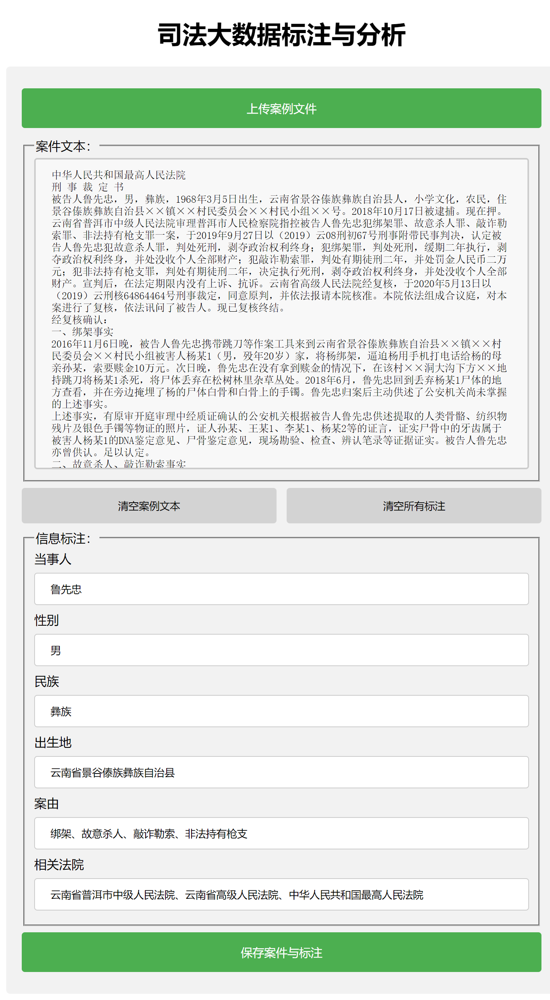
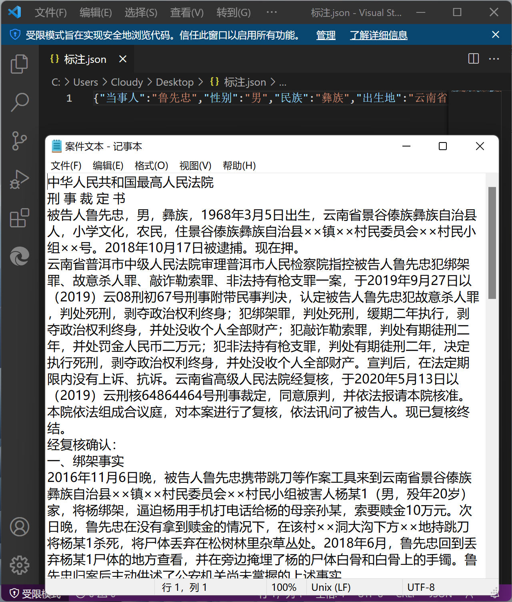

# 司法大数据自动化标注与分析（70分实现）

## 70分要求

## 网页效果

## 示例展示

**示例所下载的文件位于 “Data-Science-Program\download\70分案件文本与标注” 路径下**

## 代码解读

源码分为三个部分，位于 “Data-Science-Program\src\70分源代码” 路径下，将代码拷贝到本地即可跑

- 司法大数据自动化标注与分析.html  ············································  网页主体的编写
- 司法大数据自动化标注与分析.css  ···············································  美化布局格式
- 司法大数据自动化标注与分析.js  ··················································  实现各种按钮的功能逻辑

重点在于.js文件，其实现了：

1. 案例文件的上传与案件文本的显示
2. 案件文本、标注的清空
3. 案件与标注的保存
4. 案件文本或某标注为空时的弹窗警告

## 优化提升

对比助教给出的70分演示，做了如下的优化提升：

1. 更加美观的页面
2. 更友好的用户交互
3. 清空功能
4. 弹窗警告功能

## PS

- 上传文件目前仅支持 “.txt” 文件
- 下载文件分别为 ”案件文本.txt” 与 “标注.json”
- 建议使用 Chrome 或 Edge 测试，其他浏览器适配效果未知

